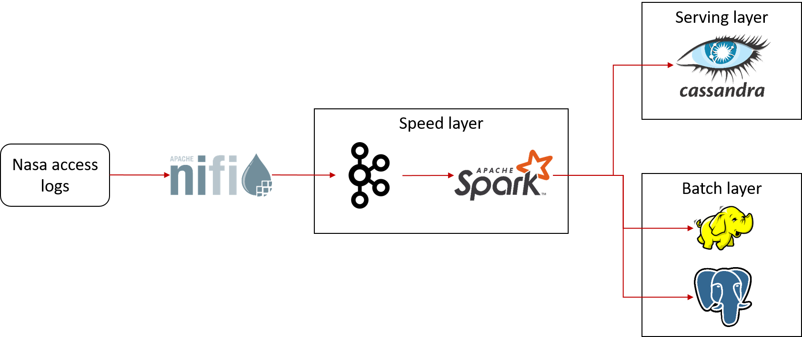
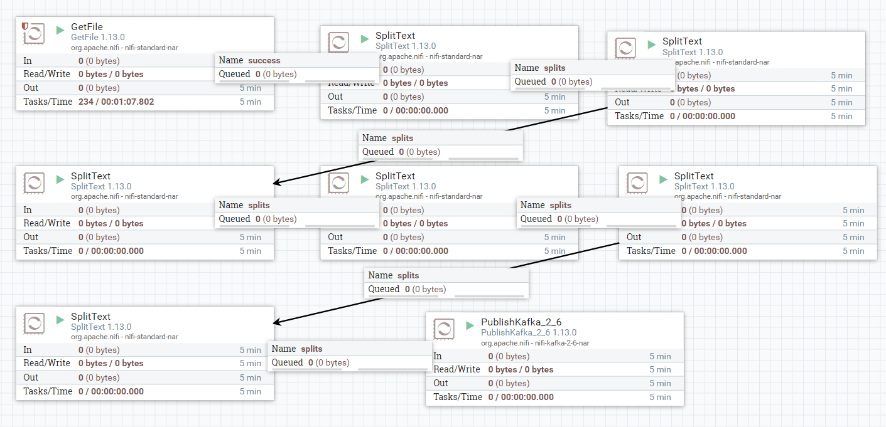

# logs-analytics

## About the project

This repository is an example of pipeline using lambda architecture. 
The process combines streaming and batch at the same pipeline.
There are 3 layers in this architecture: Speed, Serving, and Batch layer.
Nifi and Kafka is used to process streaming data, and then will be fed to batch processing using Spark.

The flow of pipeline can be seen as diagram below:

We use Nasa access logs to be ingested. You can follow this [link](https://www.kaggle.com/datasets/souhagaa/nasa-access-log-dataset-1995) to see more detail. 
The access logs will be then stored on top of Cassandra, HDFS and Postgresql.

## Getting started

These are prerequisites that must be done before start the project:

1. Setup a GCP VM
2. Install Nifi, Kafka, Spark, Cassandra, HDFS and Postgresql using docker compose. You can find find docker-compose.yml on the repository

## Usage
Here are steps to use run the project:
1. Create dataflow on Apache Nifi at: <GCP VM IP>:2080. Create processors that process data from GetFile, several SplitText,and PublishKafka. Below is example of dataflow:

2. Create Cassandra keyspace and table: <code> CREATE KEYSPACE IF NOT EXISTS log_analytics WITH replication = {'class':'SimpleStrategy', 'replication_factor':1};
    CREATE TABLE IF NOT EXISTS log_analytics.nasa_logs (host text , time text , method text , url text , response text , bytes text, extension text, time_added text,PRIMARY KEY (host)) </code>
3. Create folder on HDFS: <code>  hdfs dfs -mkdir -p /output/nasa_logs/ </code>
4. Create table on Postgres on database logs_analytics: <code> CREATE TABLE IF NOT EXISTS nasa_log (host varchar , time varchar , method varchar , url varchar , response varchare , bytes varchar, extension varchar, time_added varchar); </code>
5. Run dataflow on Nifi
6. Run Spark code to read stream data from Kafka and store to database
